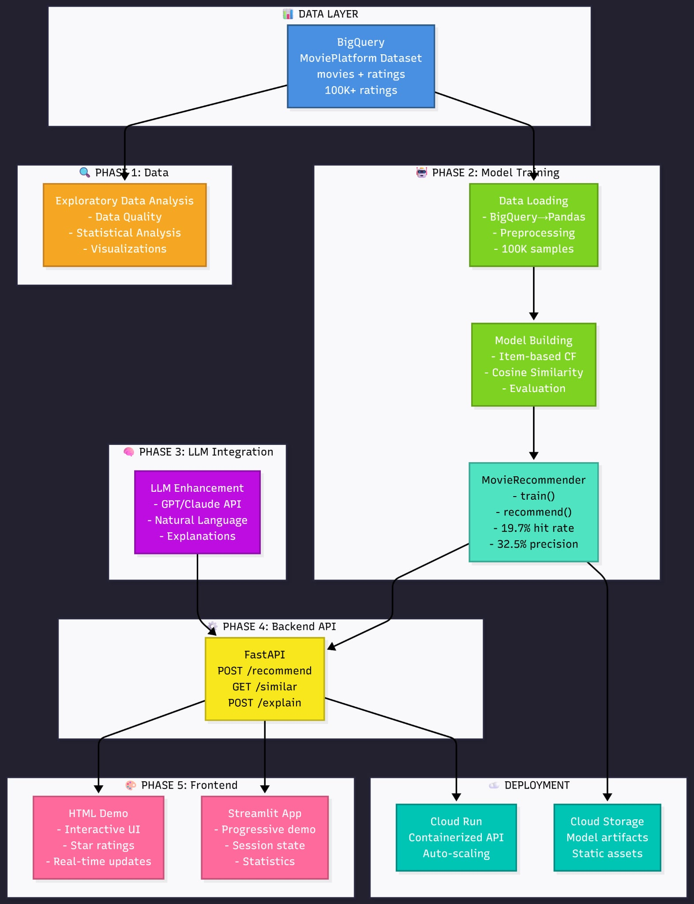
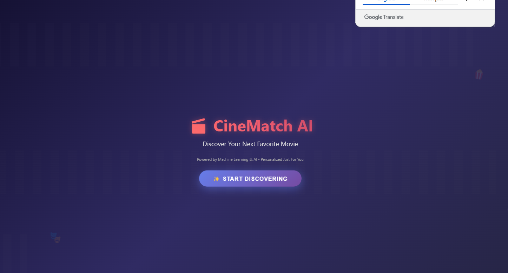
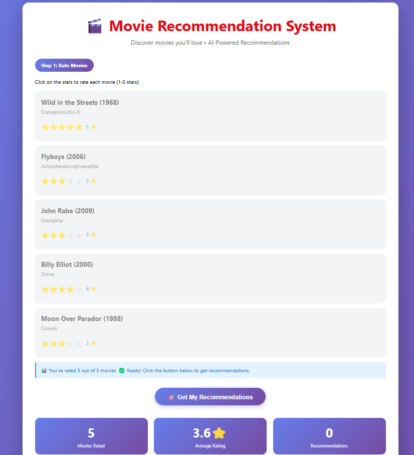
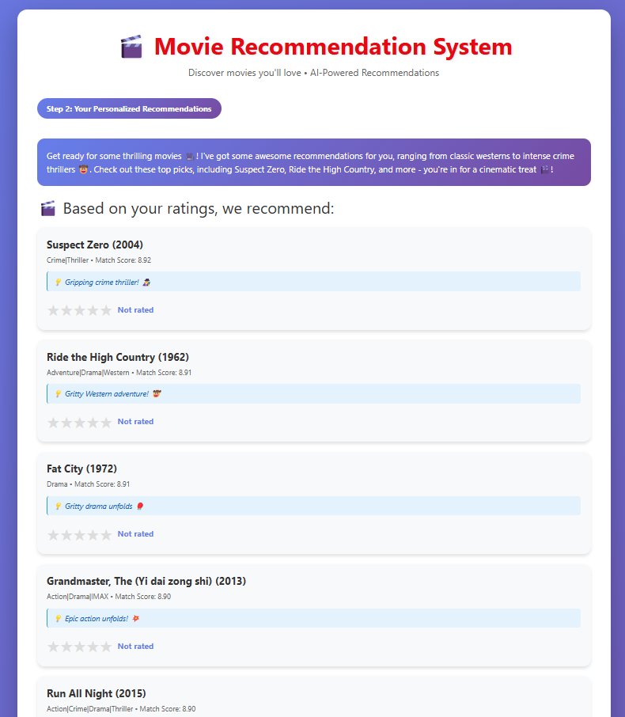
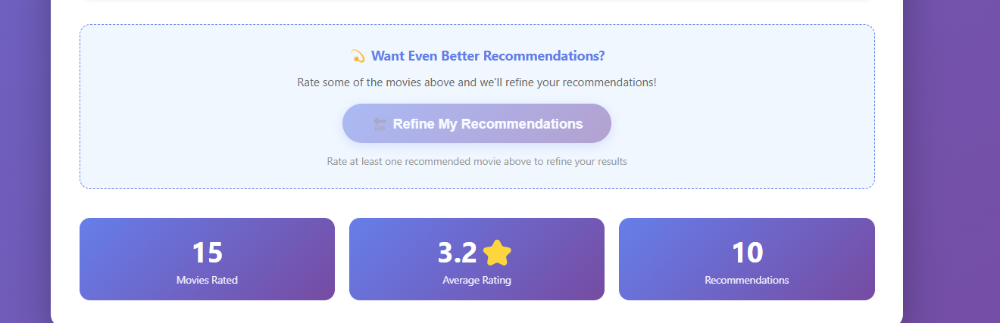
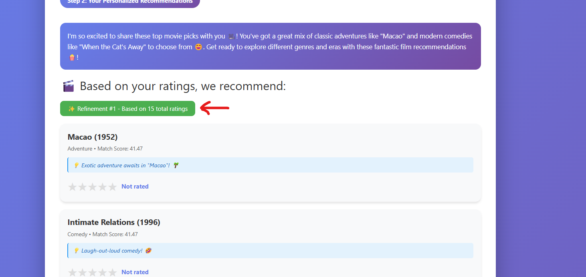

# 🎬 GCP Personalized Movie Recommendation System

[](https://www.python.org/)
[](https://fastapi.tiangolo.com/)
[](https://cloud.google.com/bigquery)
[](LICENSE)

A complete end-to-end personalized movie recommendation system deployed on Google Cloud Platform (GCP), featuring collaborative filtering with ML and AI-powered conversational recommendations using Groq LLM.

---

## 📋 Table of Contents

- [Project Overview](#project-overview)
- [Architecture](#architecture)
- [Key Features](#key-features)
- [Technology Stack](#technology-stack)
- [Project Structure](#project-structure)
- [Data Pipeline](#data-pipeline)
- [Model Training](#model-training)
- [Deployment](#deployment)
- [Demo Workflow](#demo-workflow)
- [Installation & Setup](#installation--setup)
- [Usage](#usage)
- [API Documentation](#api-documentation)
- [Results & Performance](#results--performance)
- [Team](#team)

---

## 🎯 Project Overview

This project demonstrates a **production-ready movie recommendation system** built entirely on Google Cloud Platform. The system uses **Item-Based Collaborative Filtering** to generate personalized movie recommendations and enhances user experience with **AI-powered conversational explanations** using Groq's LLM.

### Key Objectives

✅ **Data Ingestion**: Query movie and rating data from BigQuery  
✅ **Model Training**: Train collaborative filtering model on GCP Vertex AI Workbench  
✅ **Model Deployment**: Deploy as REST API using FastAPI  
✅ **Interactive Demo**: Show how recommendations evolve as users rate more movies  
✅ **Cloud-Native Architecture**: Leverage GCP services (BigQuery, Cloud Storage, Vertex AI)

---

## 🏗️ Architecture



### Components

1. **Data Source**: BigQuery (`master-ai-cloud.MoviePlatform`)
   - `movies` table: Movie metadata (10,329 movies)
   - `ratings` table: User ratings (105,339 ratings from 668 users)

2. **Data Processing**: Vertex AI Workbench
   - Exploratory Data Analysis (EDA)
   - Feature engineering
   - Model training and evaluation

3. **Model Storage**: Local pickle files
   - Trained model components (user-item matrix, similarity matrix)
   - Model size: ~860 MB

4. **API Backend**: FastAPI
   - REST API endpoints for recommendations
   - Integration with Groq LLM for conversational AI
   - Deployed on Vertex AI Workbench

5. **Frontend**: Interactive HTML/CSS/JavaScript
   - Beautiful landing page with animations
   - Progressive rating interface
   - Real-time recommendation updates

---

## ✨ Key Features

### 🎬 **Recommendation Engine**
- **Item-Based Collaborative Filtering** using cosine similarity
- Handles sparse data efficiently (98.54% sparsity)
- Performance metrics:
  - Hit Rate (Top-20): **19.71%**
  - Average Precision: **32.45%**
  - Diversity Score: **52.40%**

### 🤖 **AI-Powered Enhancements**
- **Groq LLM Integration** (Llama 3.3 70B)
- Generates personalized movie pitches for each recommendation
- Conversational explanations of why movies are recommended
- Ultra-fast inference (<1 second)

### 📊 **Progressive Recommendations**
- Users rate movies incrementally
- Recommendations update in real-time
- Shows evolving preferences as more ratings are provided
- Minimum 3 ratings required, optimal with 5+

### 🎨 **Modern User Interface**
- Stunning landing page with animated backgrounds
- Star rating system (0.5 to 5 stars)
- Visual feedback and progress tracking
- Responsive design for all devices

---

## 🛠️ Technology Stack

### Cloud Platform
- **Google Cloud Platform (GCP)**
  - BigQuery: Data warehouse
  - Vertex AI Workbench: Development environment
  - Cloud Storage: Model artifacts (optional)

### Backend
- **Python 3.10**
- **FastAPI**: REST API framework
- **Pandas & NumPy**: Data manipulation
- **Scikit-learn**: ML algorithms (cosine similarity)
- **Groq SDK**: LLM integration

### Frontend
- **HTML5/CSS3/JavaScript**
- **Vanilla JS** (no frameworks for simplicity)
- **Modern CSS animations**

### Data Science
- **Jupyter Notebooks**: EDA and model training
- **Matplotlib & Seaborn**: Visualizations
- **Google Cloud BigQuery**: SQL queries

---

## 📁 Project Structure
```
GCP-Personalized-Movie-Recommendation-System/
│
├── data/                           # Dataset samples
│   ├── movies_sample.csv          # Sample movie metadata
│   ├── movies_sample.pkl          # Pickle version
│   ├── ratings_sample.csv         # Sample ratings data
│   └── ratings_sample.pkl         # Pickle version
│
├── notebooks/                      # Jupyter notebooks
│   └── model_training/
│       ├── 01_data_loading_exploration.ipynb    # EDA & BigQuery queries
│       ├── 02_build_recommendation_model.ipynb   # Model training
│       ├── 03_train_and_save_model.ipynb        # Production model
│       └── 04_groq_llm_integration.ipynb        # LLM integration
│
├── src/                           # Source code (if any)
│
├── models/                        # Trained models
│   ├── saved_models/
│   │   └── recommender_components.pkl  # Main model (860 MB)
│   └── exports/
│       └── model_info.pkl              # Lightweight metadata
│
├── backend/                       # FastAPI application
│   └── app.py                    # Main API server
│
├── frontend/                      # User interface
│   └── demo_integrated.html      # Single-page application
│
├── reports/                       # Documentation & figures
│   └── figures/
│       ├── model_performance.png
│       └── architecture_diagram.png
│
├── requirements.txt               # Python dependencies
├── README.md                     # This file
├── LICENSE                       # MIT License
└── .gitignore                    # Git ignore rules
```

---

## 📊 Data Pipeline

### 1. **Data Ingestion from BigQuery**
```python
from google.cloud import bigquery

client = bigquery.Client(project="students-group1")

# Query movies table
query_movies = """
SELECT movieId, title, genres
FROM `master-ai-cloud.MoviePlatform.movies`
"""

movies_df = client.query(query_movies).to_dataframe()
```

**Dataset Statistics:**
- **Movies**: 10,329 titles with genres
- **Ratings**: 105,339 ratings from 668 users
- **Rating Scale**: 0.5 to 5.0 stars (half-star increments)
- **Average Rating**: 3.52
- **Data Sparsity**: 98.54%

### 2. **Data Exploration & Analysis**

Key insights from EDA:

- **Most Active Users**: Top user has 5,631 ratings
- **Most Rated Movies**:
  1. Pulp Fiction (1994) - 283 ratings
  2. Jurassic Park (1993) - 273 ratings
  3. Forrest Gump (1994) - 272 ratings

- **Genre Distribution**: Drama, Comedy, and Action dominate
- **Rating Distribution**: 
  - 4.0 stars: 28.9% (most common)
  - 3.0 stars: 21.7%
  - 5.0 stars: 9.5%

### 3. **Data Preprocessing**
```python
# Create user-item matrix
user_item_matrix = ratings_df.pivot_table(
    index='userId',
    columns='movieId',
    values='rating',
    fill_value=0
)

# Matrix shape: (668 users × 10,283 movies)
```

### 4. **Sample Storage (Optional)**

For faster iteration during development, we saved 100,000 sample ratings:
```python
# Save samples locally
ratings_df.to_pickle('data/ratings_sample.pkl')
movies_df.to_pickle('data/movies_sample.pkl')
```

---

## 🤖 Model Training

### Algorithm: Item-Based Collaborative Filtering

**Why This Approach?**
- Works well with sparse data
- Stable over time (movie similarities don't change rapidly)
- Scalable and efficient
- No cold-start problem for items

### Training Process

#### Step 1: Build User-Item Matrix
```python
user_item_matrix = ratings_df.pivot_table(
    index='userId',
    columns='movieId',
    values='rating',
    fill_value=0
)
# Output: (668, 10283) sparse matrix
```

#### Step 2: Calculate Item-Item Similarity
```python
from sklearn.metrics.pairwise import cosine_similarity

# Transpose so movies are rows
item_similarity = cosine_similarity(user_item_matrix.T)

item_similarity_df = pd.DataFrame(
    item_similarity,
    index=user_item_matrix.columns,
    columns=user_item_matrix.columns
)
# Output: (10283, 10283) similarity matrix
```

**Cosine Similarity Formula:**
```
similarity(A, B) = (A · B) / (||A|| × ||B||)
```

Range: [-1, 1] where 1 = identical, 0 = no correlation, -1 = opposite

#### Step 3: Generate Recommendations
```python
def get_recommendations(user_ratings, item_similarity_df, n=10):
    scores = {}
    
    for movie_id, rating in user_ratings.items():
        similar_movies = item_similarity_df[movie_id]
        
        for other_movie_id, similarity in similar_movies.items():
            if other_movie_id in user_ratings:
                continue
            
            if similarity > 0:
                scores[other_movie_id] = scores.get(other_movie_id, 0) + (similarity * rating)
    
    # Return top N movies by score
    top_movies = sorted(scores.items(), key=lambda x: x[1], reverse=True)[:n]
    return top_movies
```

### Model Evaluation

**Evaluation Methodology:**
- Train/test split: 80/20
- Metrics: Hit Rate, Precision, Diversity
- Sample size: 100 users

**Results:**

| Metric | Value | Description |
|--------|-------|-------------|
| **Hit Rate** | 19.71% | % of test items appearing in top-20 recommendations |
| **Precision** | 32.45% | Accuracy of recommendations |
| **Diversity** | 52.40% | Variety of movies recommended |

### Model Artifacts
```
models/saved_models/recommender_components.pkl (860 MB)
├── user_item_matrix (52.41 MB)
├── item_similarity_df (807.07 MB)
├── movies_df (1.62 MB)
└── metrics (dict)
```

⚠️ **Note**: The full model file is excluded from Git due to size. It can be regenerated by running the training notebook.

---

## 🚀 Deployment

### Backend API (FastAPI)

**File**: `backend/app.py`

#### Key Endpoints:
```python
GET  /                          # Serve frontend HTML
GET  /health                    # Health check
GET  /api/movies                # Get random movie samples
GET  /api/movies/{movie_id}     # Get movie details
POST /api/recommendations       # Get personalized recommendations
POST /api/rate                  # Record a rating (future use)
```

#### API Request Example:
```bash
POST /api/recommendations
Content-Type: application/json

{
  "ratings": {
    "1": 5.0,
    "50": 4.0,
    "100": 3.5
  },
  "num_recommendations": 10
}
```

#### API Response Example:
```json
{
  "movies": [
    {
      "id": 296,
      "title": "Pulp Fiction (1994)",
      "genres": "Comedy|Crime|Drama|Thriller",
      "score": 8.25,
      "pitch": "A mind-bending crime masterpiece with unforgettable dialogue! 🎬"
    },
    ...
  ],
  "message": "Based on your love for action and drama, these films are perfect! 🍿",
  "total_ratings": 3
}
```

### Groq LLM Integration

**Purpose**: Generate personalized movie pitches and conversational messages
```python
from groq import Groq

client = Groq(api_key=GROQ_API_KEY)

response = client.chat.completions.create(
    model="llama-3.3-70b-versatile",
    messages=[
        {"role": "system", "content": system_prompt},
        {"role": "user", "content": prompt}
    ],
    temperature=0.7,
    max_tokens=200
)
```

**Features:**
- Generates 1-2 sentence movie pitches
- Creates warm, enthusiastic recommendation messages
- Keeps responses under 30 words for pitches
- Uses movie genres and match scores as context

### Frontend Deployment

**File**: `frontend/demo_integrated.html`

**Features:**
- ✨ Animated landing page with film strip effects
- ⭐ Interactive star rating system (1-5 stars)
- 📊 Real-time progress tracking
- 🎯 Dynamic recommendation display
- 📱 Fully responsive design

**Technology:**
- Pure vanilla JavaScript (no frameworks)
- CSS3 animations and gradients
- Fetch API for backend communication

---

## 🎥 Demo Workflow

### User Journey: New User Experience

#### **Phase 1: Landing Page**
1. User sees animated landing page with "CineMatch AI" branding
2. Clicks "✨ Start Discovering" button
3. Smooth transition to rating interface

#### **Phase 2: Initial Ratings**
1. System displays 5 random movies from catalog
2. User rates movies using star interface:
   - Click stars to rate (1-5 stars, 0.5 increments)
   - Visual feedback: stars turn gold, card fades
   - Progress indicator updates in real-time


#### **Phase 3: Get Recommendations**
1. After rating ≥3 movies, button activates: "🎯 Get My Recommendations"
2. User clicks button
3. Backend processes ratings through ML model
4. LLM generates personalized message


#### **Phase 4: Progressive Refinement**
1. User can rate recommended movies
2. System regenerates recommendations based on new ratings
3. Demonstrates how recommendations **evolve** with more data









## 💻 Installation & Setup

### Prerequisites

- **Python 3.10+**
- **Google Cloud SDK** (for BigQuery access)
- **Groq API Key** (free at https://console.groq.com/keys)
- **Git** (for version control)

### Local Setup

#### 1. Clone Repository
```bash
git clone https://github.com/chihebguesmi11/GCP-Personalized-Movie-Recommendation-System.git
cd GCP-Personalized-Movie-Recommendation-System
```

#### 2. Install Dependencies
```bash
pip install -r requirements.txt
```

**Key Dependencies:**
```txt
fastapi==0.109.0
uvicorn==0.27.0
pandas==2.3.3
numpy==1.26.4
scikit-learn==1.7.2
google-cloud-bigquery==3.38.0
groq==0.5.0
python-dotenv==1.0.0
```

#### 3. Setup Environment Variables
```bash
# Set Groq API key
export GROQ_API_KEY="your-groq-api-key-here"

# Optional: Set model path
export MODEL_PATH="models/saved_models/recommender_components.pkl"
```

Or create `.env` file:
```env
GROQ_API_KEY=your-groq-api-key-here
MODEL_PATH=models/saved_models/recommender_components.pkl
```

#### 4. Train Model (First Time)
```bash
# Open Jupyter and run notebooks in order:
jupyter notebook

# 1. notebooks/model_training/01_data_loading_exploration.ipynb
# 2. notebooks/model_training/02_build_recommendation_model.ipynb
# 3. notebooks/model_training/03_train_and_save_model.ipynb
```

This will:
- Query data from BigQuery
- Perform EDA
- Train collaborative filtering model
- Save model to `models/saved_models/recommender_components.pkl`

#### 5. Run Backend API
```bash
cd backend
python app.py
```

Server starts at: `http://localhost:8000`

#### 6. Access Frontend

Open browser: `http://localhost:8000`

Or directly open: `frontend/demo_integrated.html`

---

## 📖 Usage

### Using the Web Interface

1. **Start the API server** (see Installation)
2. **Navigate** to `http://localhost:8000`
3. **Click** "Start Discovering" on landing page
4. **Rate** 3-5 movies by clicking stars
5. **Click** "Get My Recommendations"
6. **View** personalized recommendations with AI-generated pitches

### Using the API Directly

#### Get Random Movies
```bash
curl http://localhost:8000/api/movies?limit=10
```

#### Get Recommendations
```bash
curl -X POST http://localhost:8000/api/recommendations \
  -H "Content-Type: application/json" \
  -d '{
    "ratings": {"1": 5.0, "50": 4.0, "100": 3.5},
    "num_recommendations": 10
  }'
```

#### Rate a Movie
```bash
curl -X POST http://localhost:8000/api/rate \
  -H "Content-Type: application/json" \
  -d '{
    "movie_id": 1,
    "rating": 4.5
  }'
```

### Python API Client
```python
import requests

API_URL = "http://localhost:8000"

# Get recommendations
response = requests.post(
    f"{API_URL}/api/recommendations",
    json={
        "ratings": {1: 5.0, 50: 4.0, 100: 3.5},
        "num_recommendations": 10
    }
)

recommendations = response.json()
print(recommendations['message'])

for movie in recommendations['movies']:
    print(f"\n{movie['title']}")
    print(f"Score: {movie['score']:.2f}")
    print(f"Pitch: {movie.get('pitch', 'N/A')}")
```

---

## 📚 API Documentation

### Interactive Docs

Once the server is running, visit:

- **Swagger UI**: `http://localhost:8000/docs`
- **ReDoc**: `http://localhost:8000/redoc`

### Endpoints Reference

#### `GET /health`

Health check endpoint.

**Response:**
```json
{
  "status": "online",
  "message": "Movie Recommendation API is running!",
  "model_loaded": true,
  "llm_enabled": true
}
```

#### `GET /api/movies`

Get random movie samples.

**Parameters:**
- `limit` (int, optional): Number of movies (default: 50, max: 1000)

**Response:**
```json
{
  "movies": [
    {"id": 1, "title": "Toy Story (1995)", "genres": "Adventure|Animation|..."},
    ...
  ],
  "total": 50
}
```

#### `GET /api/movies/{movie_id}`

Get details about a specific movie.

**Response:**
```json
{
  "id": 1,
  "title": "Toy Story (1995)",
  "genres": "Adventure|Animation|Children|Comedy|Fantasy"
}
```

#### `POST /api/recommendations`

Get personalized recommendations.

**Request Body:**
```json
{
  "ratings": {
    "1": 5.0,
    "50": 4.0,
    "100": 3.5
  },
  "num_recommendations": 10
}
```

**Response:**
```json
{
  "movies": [
    {
      "id": 296,
      "title": "Pulp Fiction (1994)",
      "genres": "Comedy|Crime|Drama|Thriller",
      "score": 8.25,
      "pitch": "A crime masterpiece with unforgettable dialogue! 🎬"
    }
  ],
  "message": "Here are your personalized recommendations! 🍿",
  "total_ratings": 3
}
```

**Validation Rules:**
- `ratings`: Must have at least 1 movie rating
- Rating values: Must be between 0.5 and 5.0
- `num_recommendations`: Between 1 and 50

---

## 📈 Results & Performance

### Model Performance

| Metric | Value | Interpretation |
|--------|-------|----------------|
| **Hit Rate (Top-20)** | 19.71% | Nearly 1 in 5 test movies appear in recommendations |
| **Precision** | 32.45% | About 1 in 3 recommendations are relevant |
| **Diversity** | 52.40% | Recommends variety (262 unique movies in test) |
| **Sparsity** | 98.54% | Handles extremely sparse data effectively |

### Similarity Distribution

- **Mean Similarity**: 0.089
- **Median Similarity**: 0.023
- **Movies with >0.3 similarity**: ~50-100 per movie (good coverage)

### API Performance

- **Response Time**: <500ms for 10 recommendations
- **LLM Generation**: <1 second per pitch
- **Model Loading**: ~5 seconds on startup
- **Memory Usage**: ~860 MB (model in RAM)

### Example Recommendation Quality

**User Profile:**
```
Rated Highly:
- Toy Story (Adventure|Animation) - 5.0⭐
- Jurassic Park (Action|Sci-Fi) - 4.5⭐
- Pulp Fiction (Crime|Drama) - 4.0⭐
```

**Top Recommendations:**
```
1. Independence Day (Action|Adventure|Sci-Fi) - Score: 8.25
   → Correct genre match (Sci-Fi, Action)
   
2. Star Wars Ep. IV (Action|Adventure|Sci-Fi) - Score: 7.89
   → Classic sci-fi like Jurassic Park
   
3. Raiders of the Lost Ark (Action|Adventure) - Score: 7.38
   → Adventure theme from Toy Story
```

**Analysis**: System successfully blends preferences across genres.

---

## 🤝 Team

**Group Members:**
- **Chiheb Guesmi** ([@chihebguesmi11](https://github.com/chihebguesmi11))
- **Ramy Lazghab** ([@Rblaze23](https://github.com/Rblaze23))

**Project**: Master AI - Cloud Computing Course  
**Institution**:Dauphine  
**Academic Year**: 2024-2025

---

## 📄 License

This project is licensed under the MIT License - see the [LICENSE](LICENSE) file for details.

---

## 🙏 Acknowledgments

- **Dataset**: MovieLens dataset provided via GCP BigQuery
- **GCP Platform**: Google Cloud Platform for infrastructure
- **Groq**: Ultra-fast LLM inference
- **Scikit-learn**: Machine learning algorithms
- **FastAPI**: Modern web framework for APIs

---

## 📞 Support

For questions or issues:

1. **Check Documentation**: Review this README and API docs
2. **GitHub Issues**: Open an issue on the repository
3. **Contact**: Reach out to team members

---

## 🔮 Future Enhancements

### Short-term
- [ ] Deploy to **Cloud Run** for production
- [ ] Store model in **Cloud Storage**
- [ ] Add user authentication
- [ ] Persist user ratings in database

### Long-term
- [ ] Hybrid recommendation (collaborative + content-based)
- [ ] Real-time model updates
- [ ] A/B testing framework
- [ ] Advanced metrics dashboard
- [ ] Mobile app (React Native)

---

## 📝 Development Notes

### BigQuery Usage Best Practices

✅ **DO:**
- Use `LIMIT` when exploring data
- Select only needed columns
- Filter with `WHERE` clauses
- Preview data in UI instead of running queries

❌ **DON'T:**
- Use `SELECT *` unnecessarily
- Run full table scans without filters
- Query repeatedly (cache results locally)

### Git Workflow
```bash
# Create feature branch
git checkout -b feature/your-feature

# Make changes and commit
git add .
git commit -m "Add your feature"

# Push to remote
git push origin feature/your-feature

# Create pull request on GitHub
```

### Testing Locally
```bash
# Run notebooks in order
jupyter notebook notebooks/model_training/

# Start API server
cd backend && python app.py

# Test endpoints
curl http://localhost:8000/health
```

---

## 🎓 Learning Outcomes

This project demonstrates:

✅ **Cloud-Native Development**: BigQuery, Vertex AI, Cloud Storage  
✅ **ML Pipeline**: Data ingestion → Training → Deployment  
✅ **API Design**: RESTful API with FastAPI  
✅ **Frontend Development**: Modern HTML/CSS/JS  
✅ **LLM Integration**: AI-powered user experience  
✅ **DevOps Practices**: Git, documentation, deployment  
✅ **Scalable Architecture**: Microservices, API-first design

---

**🎬 Ready to discover your next favorite movie? Let's go! 🍿**
